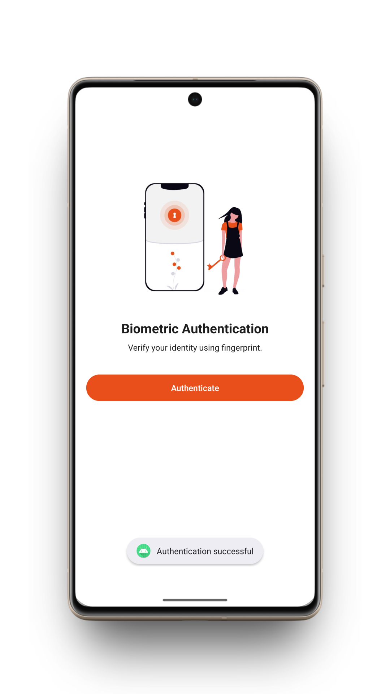
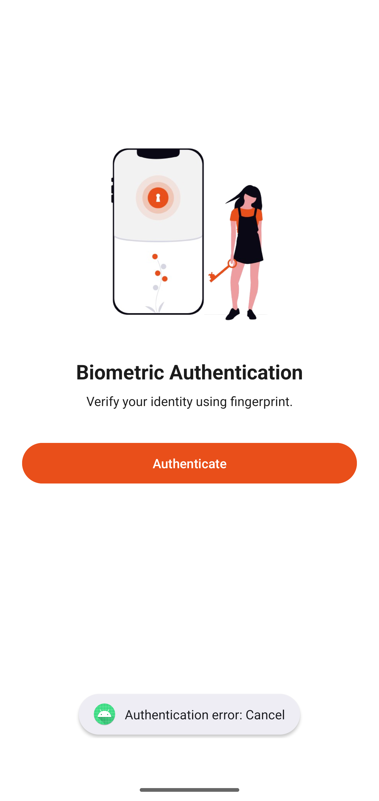
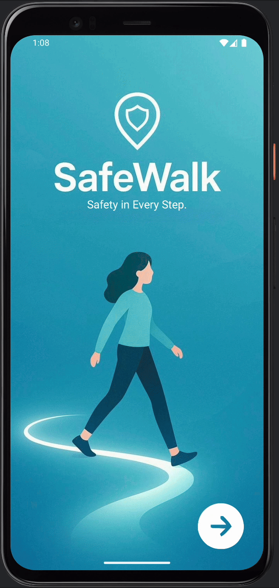

# Android BiometricPrompt

## 📍Zakaj Android BiometricPrompt API?

Android BiometricPrompt API je uradna Android knjižnica, ki omogoča varno in enostavno biometrično avtentikacijo uporabnikov. Uporablja lahko prstni odtis, prepoznavo obraza ali druge biometrične metode, ki jih podpira naprava. Ker je del Android SDK-ja, gre za priporočeno in zanesljivo rešitev s strani podjetja Google.

Tehnologija je bila izbrana predvsem zaradi dobre kombinacije varnosti in uporabniške izkušnje. Uporabniku ni treba vnašati gesel ali PIN-kod, temveč se lahko preveri s pomočjo biometričnih podatkov, kar je hitrejše in bolj priročno. Hkrati aplikacija ne shranjuje občutljivih podatkov, saj so biometrični podatki varno shranjeni v sistemu naprave.

Biometrična avtentikacija je danes zelo razširjena in se pogosto uporablja v aplikacijah, kjer je varnost še posebej pomembna, na primer v bančnih, zdravstvenih ali varnostnih aplikacijah. Zaradi tega je Android BiometricPrompt API primerna izbira tudi za aplikacijo SafeWalk, kjer je cilj zaščita uporabnika in zanesljiva potrditev njegove identitete.


## 🟢 Prednosti

- omogoča visoko raven varnosti brez uporabe gesel ali PIN-kod
- uporabniku prijazen način avtentikacije (hiter in enostaven)
- del uradnega Android SDK-ja in priporočena rešitev s strani Googla
- podpira različne vrste biometrije (prstni odtis, prepoznava obraza, ipd.)
- aplikacija ne shranjuje biometričnih podatkov, kar poveča varnost

## 🔴 Slabosti

- zahteva napravo z vgrajenim biometričnim senzorjem
- ni podprt na zelo starih Android napravah
- delovanje je odvisno od kakovosti strojne opreme naprave


## 📎 Licenca

Android BiometricPrompt API je na voljo pod licenco [Apache License 2.0](https://www.apache.org/licenses/LICENSE-2.0).

Licenca Apache 2.0 omogoča:
- prosto uporabo tehnologije za osebne, izobraževalne in komercialne namene
- spreminjanje in prilagajanje kode brez posebnih omejitev
- distribucijo programske opreme ob upoštevanju pogojev licence


## 👥 Število uporabnikov

Android BiometricPrompt API je na voljo na večini sodobnih Android naprav, ki podpirajo biometrično avtentikacijo (npr. prstni odtis ali prepoznavo obraza). Ker Android uporablja več milijard uporabnikov po vsem svetu, je ta tehnologija potencialno dostopna zelo širokemu krogu uporabnikov.


## ⚙️ Časovna in prostorska zahtevnost

- **Časovna zahtevnost:**  
  Biometrična avtentikacija poteka zelo hitro, saj preverjanje identitete izvaja naprava sama. Postopek običajno traja le nekaj milisekund, zato nima opaznega vpliva na delovanje aplikacije.

- **Prostorska zahtevnost:**  
  Uporaba BiometricPrompt API-ja ne zahteva dodatnega prostora za shranjevanje biometričnih podatkov v aplikaciji. Biometrični podatki so varno shranjeni na ravni operacijskega sistema, zato je poraba pomnilnika minimalna.


## 🛠️ Vzdrževanje tehnologije

Android BiometricPrompt API je del knjižnice androidx.biometric, ki jo razvija in vzdržuje podjetje Google kot del Android platforme. Gre za uradno podprto tehnologijo, ki se redno posodablja skupaj z razvojem operacijskega sistema Android.

- **Razvijalec:**  
  Google (Android ekipa)

- **Število razvijalcev:**  
  Natančno število razvijalcev ni javno znano, razvoj pa poteka v okviru večjih ekip Android razvijalcev, saj gre za pomembno sistemsko komponento, povezano z varnostjo uporabnikov.

- **Zadnja sprememba:**  
  Maj 2025 – zadnje posodobitve knjižnice androidx.biometric, kar kaže na aktivno vzdrževanje in nadaljnji razvoj tehnologije.

- **Dokumentacija:**  
  https://developer.android.com/reference/androidx/biometric

---

## 📱 Lastna uporaba na GitHubu (demo aplikacija)
Prikazan je preprost demo primer uporabe Android BiometricPrompt API-ja.
Aplikacija demonstrira osnovno biometrično avtentikacijo uporabnika in obravnavo možnih izjem.

### Uporabljena knjižnica
```kotlin
implementation("androidx.biometric:biometric:1.1.0")
```

### Preverjanje podpore za biometrijo
Pred zagonom biometrične avtentikacije aplikacija preveri razpoložljivost biometrije na napravi.
S tem se preprečijo napake na napravah brez ustrezne strojne podpore.

```kotlin
val biometricManager = BiometricManager.from(this)

when(biometricManager.canAuthenticate(BiometricManager.Authenticators.BIOMETRIC_STRONG)) {
    BiometricManager.BIOMETRIC_SUCCESS -> {
        biometricPrompt.authenticate(promptInfo)
    }
}
```

### Inicializacija BiometricPrompt
Razred `BiometricPrompt` skrbi za prikaz sistemskega dialoga in obravnavo rezultatov avtentikacije.
Uporaba sistemskega dialoga povečuje varnost in zagotavlja enotno uporabniško izkušnjo.

```kotlin
biometricPrompt = BiometricPrompt(
    this,
    executor,
    object : BiometricPrompt.AuthenticationCallback() {
        override fun onAuthenticationSucceeded(result: BiometricPrompt.AuthenticationResult) {
            Toast.makeText(
                this@MainActivity,
                "Authentication successful",
                Toast.LENGTH_SHORT
            ).show()
        }
    }
)
```

### Obravnava izjem
Aplikacija obravnava tudi možne izjeme, ki se lahko pojavijo pri biometrični avtentikaciji.
```kotlin
override fun onAuthenticationError(errorCode: Int,errString: CharSequence) {
    Toast.makeText(
        this@MainActivity,
        "Authentication error: $errString",
        Toast.LENGTH_SHORT
    ).show()
}

```

### 💭 Primeri

|  |  |  |
|-----------------------------|---------------------------|------------------------------------|

---

## 🎀 SafeWalk Aplikacija
